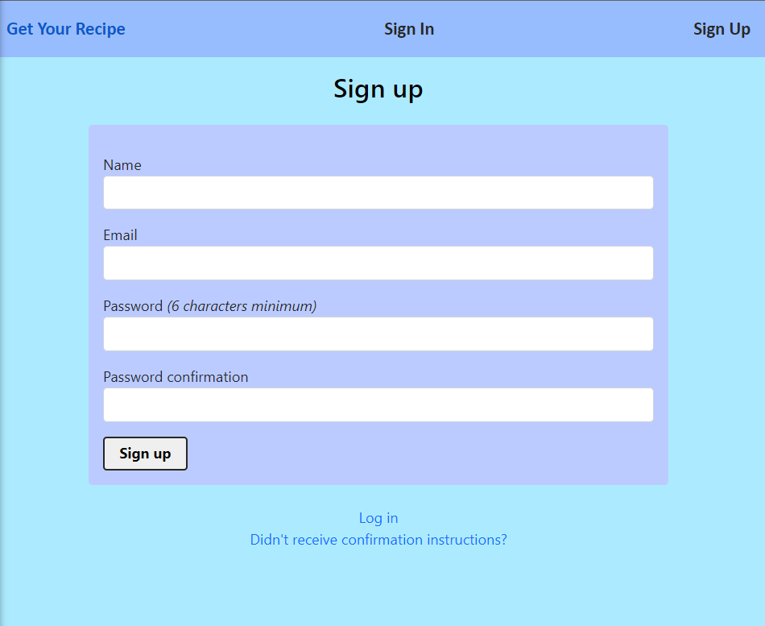
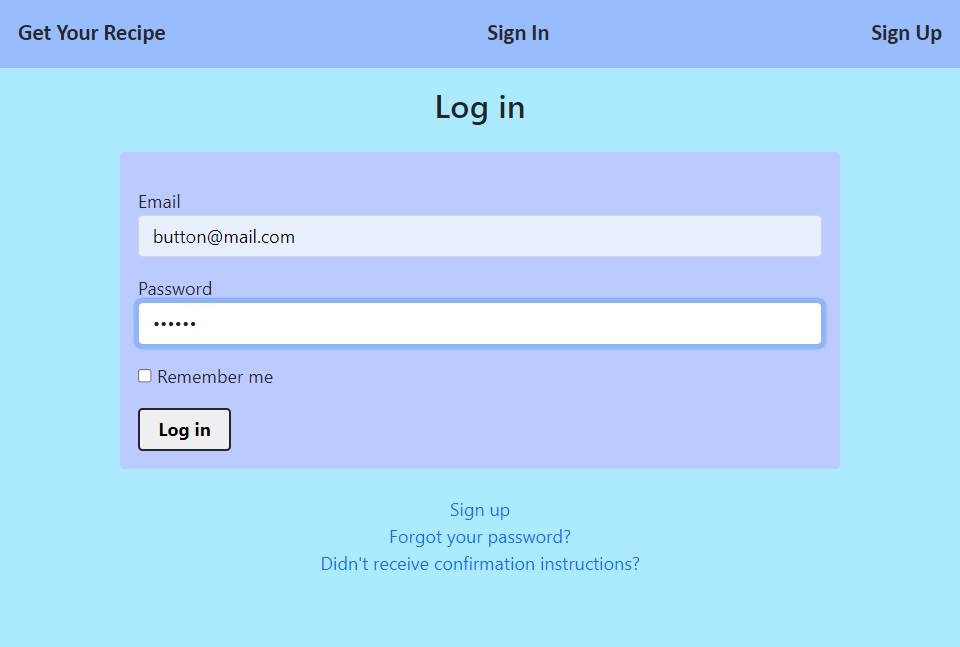
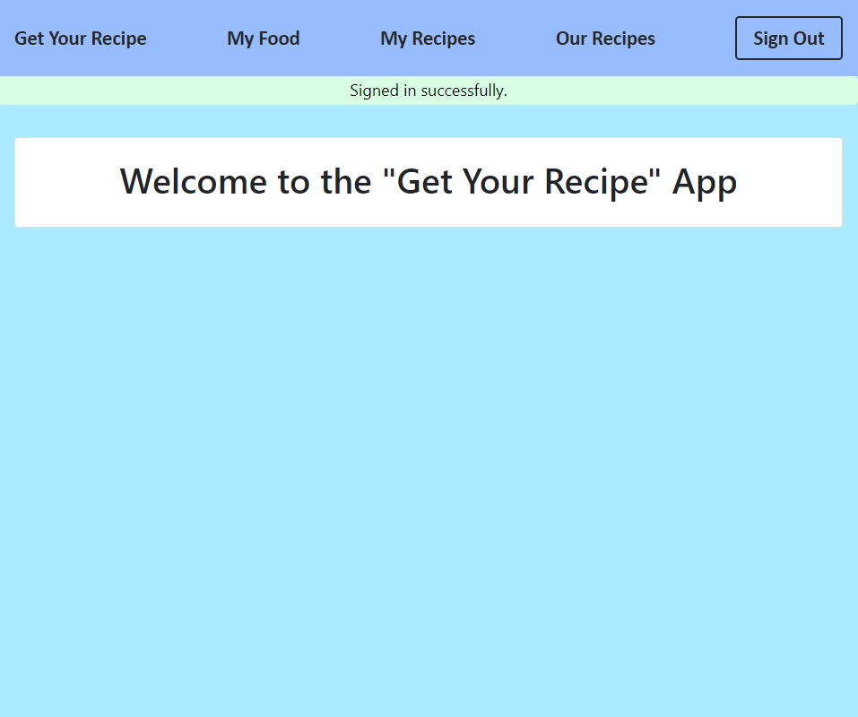
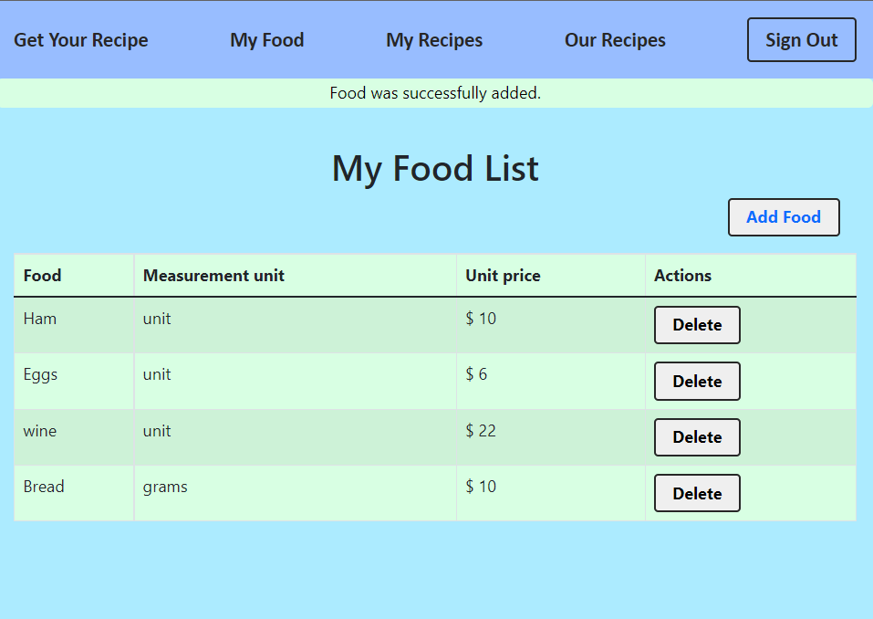
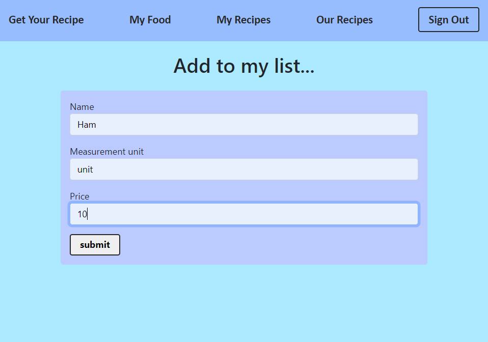
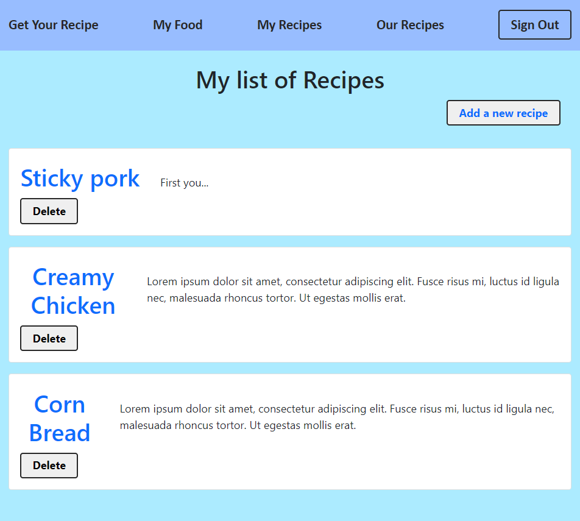

# The Get Your Recipe App

The Recipe app keeps track of all your recipes and ingredients. It will allow you to save ingredients, keep track of what you have, create recipes, and generate a shopping list based on what you have and what you are missing from a recipe. Also, since sharing recipes is an important part of cooking the app should allow you to make them public so anyone can access them.

## Link
Link to the live version [here](https://glacial-castle-61996.herokuapp.com/)

## Screenshots

> |Screenshot 1|Screenshots 2|
> |--------------|----------------|
> |||!
> |Screenshot 3|Screenshots 4|
> |--------------|----------------|
> |||!
> |Screenshot 5|Screenshots 6|
> |--------------|----------------|
> |||!

## Built With
- Ruby
- Ruby on Rails
- RSpec
- Capybara
  
## Setup
- Get the link of the repository: [https://github.com/chaw-bot/get-your-recipe](https://github.com/chaw-bot/get-your-recipe)
- Clone it as `git@github.com:chaw-bot/get-your-recipe.git` on a Terminal
- Usage
- Run bundle install on a Terminal to get Gemfile dependencies.
- Start the server by running `rails s`
  

## Run test

```bash
$ bundle exec rspec ./spec/requests/recipes_index_spec.rb
$ bundle exec rspec ./spec/requests/recipes_show_spec.rb
$ bundle exec rspec ./spec/features/food_index_spec.rb
$ bundle exec rspec ./spec/features/login_spec.rb
```


## Authors

👤 **Chawanzi Ng'uni**

- GitHub: [@chaw-bot](https://github.com/chaw-bot)
- Twitter: [@chaw36422087](https://twitter.com/chaw36422087)
- LinkedIn: [Chawanzi Ng'uni](https://www.linkedin.com/in/chawanzi-ng-uni-449328212/)

👤 **Ben Mukebo**

- GitHub: [@BenMukebo](https://github.com/BenMukebo)
- Twitter [@BenMukebo](https://twitter.com/BenMukebo)
- LinkedIn [BenMukebo](https://www.linkedin.com/in/kasongo-mukebo-ben-591720205/)

## 🤝 Contributing

Contributions, issues, and feature requests are welcome!

Feel free to check the [issues page](https://github.com/chaw-bot/get-your-recipe/issues).

## Show your support

Give a ⭐️ if you like this project!

## Acknowledgments
- Microverse
- Ruby documentation
- Stack Overflow

